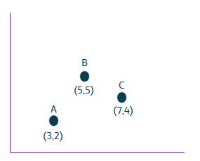
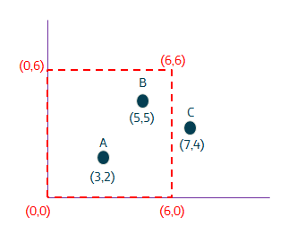
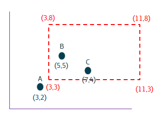
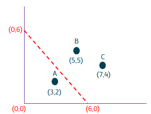
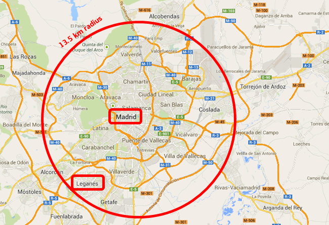
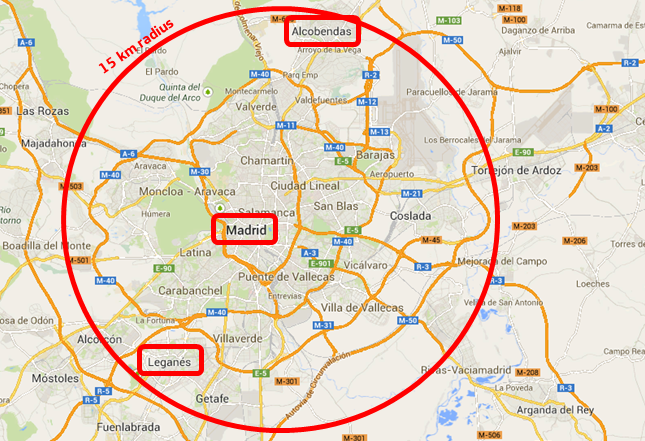
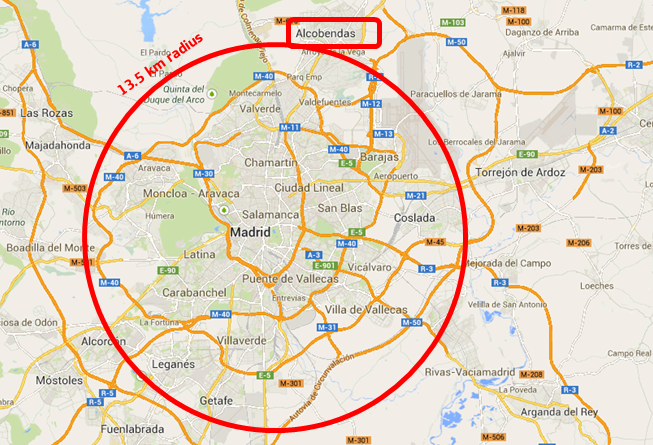

# Geolocation capabilities (using NGSIv2)

NGSIv2 allows to filter by geographical location, e.g. all the entities located
closer than 15 km from the center of Madrid. Of course, properly located entities are mandatory.

Both topics (entity location and geographical queries) are dealt in detail in
the "Geospacial properties of entities" and "Geographical Queries" sections of the
[NGSIv2 specification](http://telefonicaid.github.io/fiware-orion/api/v2/stable/).

# Geolocation capabilities (using NGSIv1)

Orion Context Broker has several capabilities related to geolocation
that are described in this section.

## Defining location attribute

Entities can have a location, specified by one of its attributes. In
order to state which attribute (among all the ones belonging to the
entity) defines the location, the `geo:point` type is used. For
example, the following updateContext request creates the entity "Madrid"
(of type "City") with attribute "position" defined as location.

``` 
(curl localhost:1026/v1/updateContext -s -S --header 'Content-Type: application/json' \
    --header 'Accept: application/json' -d @- | python -mjson.tool) <<EOF
{
    "contextElements": [
        {
            "type": "City",
            "isPattern": "false",
            "id": "Madrid",
            "attributes": [
                {
                    "name": "position",
                    "type": "geo:point",
                    "value": "40.418889, -3.691944"
                }
            ]
        }
    ],
    "updateAction": "APPEND"
} 
EOF
``` 

Additional comments:

-   Note that you can use different attributes to specify the location
    in different entities, e.g. entity "Car1" could be using "position"
    attribute, while entity "Phone22" could use attribute "coordinates".
-   In order to avoid inconsistencies, only one attribute at a time can
    be defined as location. If you want to redefine the attribute of an
    entity used for location, first you have to DELETE it, then APPEND
    the new one (check the section about [APPEND and DELETE to add and remove
    attributes dynamically](update_action_types.md)).
-   The value of the location attribute is a string with two numbers
    separated by a comma (","): the first number is the latitude and the
    second is the longitude. Only decimal notation is allowed (e.g.
    "40.418889"), degree-minute-second notation is not allowed (e.g.
    "40°44'55''N").

## Geo-located queries

Entities location can be used in
[queryContext](walkthrough_apiv1.md#query-context-operation) or  equivalent
[convenience operations](walkthrough_apiv1.md#convenience-query-context). To do
so, we use the scope element, using "FIWARE::Location" as scopeType and
an area specification as scopeValue. The query result includes only the
entities located in that area, i.e. context elements belonging to
entities not included in the area are not taken into account. Regarding
area specification, Orion Context Broker allows the following
possibilities:

-   Area internal to a circumference, given its centre and radius.
-   Area external to a circumference, given its centre and radius.
-   Area internal to a polygon (e.g. a terrain zone, a city district,
    etc.), given its vertices.
-   Area external to a polygon (e.g. a terrain zone, a city district,
    etc.), given its vertices.
-   Area unions or intersections (e.g. the intersection of a circle and
    a polygon) are not supported in the current version.

In order to illustrate geo-located queries with polygons, let's consider
the following scenario: three entities (A, B and C, of type "Point")
have been created in Orion Context Broker, each one in the coordinates
shown in the following picture.



Let's consider a query whose scope is the internal area to the square
defined by coordinates (0, 0), (0, 6), (6, 6) and (6, 0).



To define a polygon, we use the polygon element which, in sequence,
include a vertexList. A vertexList is composed by a list of vertex
elements, each one containing a couple of elements (latitude and
longitude) that provide the coordinates of the vertex. The result of the
query would be A and B.

``` 
(curl localhost:1026/v1/queryContext -s -S --header 'Content-Type: application/json' \
    --header 'Accept: application/json' -d @- | python -mjson.tool) <<EOF
{
    "entities": [
        {
            "type": "Point",
            "isPattern": "true",
            "id": ".*"
        }
    ],
    "restriction": {
        "scopes": [
            {
                "type": "FIWARE::Location",
                "value": {
                    "polygon": {
                        "vertices": [
                            {
                                "latitude": "0",
                                "longitude": "0"
                            },
                            {
                                "latitude": "0",
                                "longitude": "6"
                            },
                            {
                                "latitude": "6",
                                "longitude": "6"
                            },
                            {
                                "latitude": "6",
                                "longitude": "0"
                            }
                        ]
                    }
                }
            }
        ]
    }
}
EOF
``` 

Let's consider a query whose scope is the internal area to the rectangle
defined by coordinates (3, 3), (3, 8), (11, 8) and (11, 3).



The result of the query would be B and C.

```
(curl localhost:1026/v1/queryContext -s -S --header 'Content-Type: application/json' \
    --header 'Accept: application/json' -d @- | python -mjson.tool) <<EOF
{
    "entities": [
        {
            "type": "Point",
            "isPattern": "true",
            "id": ".*"
        }
    ],
    "restriction": {
        "scopes": [
            {
                "type": "FIWARE::Location",
                "value": {
                    "polygon": {
                        "vertices": [
                            {
                                "latitude": "3",
                                "longitude": "3"
                            },
                            {
                                "latitude": "3",
                                "longitude": "8"
                            },
                            {
                                "latitude": "11",
                                "longitude": "8"
                            },
                            {
                                "latitude": "11",
                                "longitude": "3"
                            }
                        ]
                    }
                }
            }
        ]
    }
}
EOF
```

However, if we consider the query to the external area to that
rectangle, the result of the query would be A. To specify that we refer
to the area external to the polygon we include the inverted element set
to "true".

```
(curl localhost:1026/v1/queryContext -s -S --header 'Content-Type: application/json' \
    --header 'Accept: application/json' -d @- | python -mjson.tool) <<EOF
{
    "entities": [
        {
            "type": "Point",
            "isPattern": "true",
            "id": ".*"
        }
    ],
    "restriction": {
        "scopes": [
            {
                "type": "FIWARE::Location",
                "value": {
                    "polygon": {
                        "vertices": [
                            {
                                "latitude": "3",
                                "longitude": "3"
                            },
                            {
                                "latitude": "3",
                                "longitude": "8"
                            },
                            {
                                "latitude": "11",
                                "longitude": "8"
                            },
                            {
                                "latitude": "11",
                                "longitude": "3"
                            }
                        ],
                        "inverted": "true"
                    }
                }
            }
        ]
    }
}
EOF
```

Let's consider a query whose scope is the internal area to the triangle
defined by coordinates (0, 0), (0, 6) and (6, 0).



The result of the query would be A.

```
(curl localhost:1026/v1/queryContext -s -S --header 'Content-Type: application/json' \
    --header 'Accept: application/json' -d @- | python -mjson.tool) <<EOF
{
    "entities": [
        {
            "type": "Point",
            "isPattern": "true",
            "id": ".*"
        }
    ],
    "restriction": {
        "scopes": [
            {
                "type": "FIWARE::Location",
                "value": {
                    "polygon": {
                        "vertices": [
                            {
                                "latitude": "0",
                                "longitude": "0"
                            },
                            {
                                "latitude": "0",
                                "longitude": "6"
                            },
                            {
                                "latitude": "6",
                                "longitude": "0"
                            }
                        ]
                    }
                }
            }
        ]
    }
}
EOF
```

However, if we consider the query to the external area to that triangle
(using the inverted element set to "true"), the result of the query
would be B and C.

```
(curl localhost:1026/v1/queryContext -s -S --header 'Content-Type: application/json' \
    --header 'Accept: application/json' -d @- | python -mjson.tool) <<EOF
{
    "entities": [
        {
            "type": "Point",
            "isPattern": "true",
            "id": ".*"
        }
    ],
    "restriction": {
        "scopes": [
            {
                "type": "FIWARE::Location",
                "value": {
                    "polygon": {
                        "vertices": [
                            {
                                "latitude": "0",
                                "longitude": "0"
                            },
                            {
                                "latitude": "0",
                                "longitude": "6"
                            },
                            {
                                "latitude": "6",
                                "longitude": "0"
                            }
                        ],
                        "inverted": "true"
                    }
                }
            }
        ]
    }
}
EOF
```

Now, in order to illustrate circle areas, let's consider the following
scenario: three entities (representing the cities of Madrid, Alcobendas
and Leganes) have been created in Orion Context Broker. The coordinates
for Madrid are (40.418889, -3.691944); the coordinates for Alcobendas
are (40.533333, -3.633333) and the coordinates for Leganes are
(40.316667, -3.75). The distance between Madrid and Alcobendas is
[around 13.65
km](http://boulter.com/gps/distance/?from=N+40.418889+W+3.691944++&to=N+40.533333+W+3.633333&units=k),
and the distance between Madrid and Leganes [is arround 12.38
km](http://boulter.com/gps/distance/?from=N+40.418889+W+3.691944++&to=N+40.316667+W+3.75&units=k)
(based on: <http://boulter.com/gps/distance/>).

Let's consider a query whose scope is inside a radius of 13.5 km (13500
meters) centred in Madrid.



To define a circle, we use the circle element which, in sequence,
include a three elements: centerLatitude (the latitude of the circle
center), centerLongitude (the longitude of the circle center) and radius
(in meters). The result of the query would be Madrid and Leganes.

```
(curl localhost:1026/v1/queryContext -s -S --header 'Content-Type: application/json' \
    --header 'Accept: application/json' -d @- | python -mjson.tool) <<EOF
{
    "entities": [
        {
            "type": "City",
            "isPattern": "true",
            "id": ".*"
        }
    ],
    "restriction": {
        "scopes": [
            {
                "type": "FIWARE::Location",
                "value": {
                    "circle": {
                        "centerLatitude": "40.418889",
                        "centerLongitude": "-3.691944",
                        "radius": "13500"
                    }
                }
            }
        ]
    }
}
EOF
```

Let's consider a query whose scope is inside a radius of 15 km (15000
meters) centred in Madrid.



The result of the query would be Madrid, Leganes and Alcobendas.

```
(curl localhost:1026/v1/queryContext -s -S --header 'Content-Type: application/json' \
    --header 'Accept: application/json' -d @- | python -mjson.tool) <<EOF
{
    "entities": [
        {
            "type": "City",
            "isPattern": "true",
            "id": ".*"
        }
    ],
    "restriction": {
        "scopes": [
            {
                "type": "FIWARE::Location",
                "value": {
                    "circle": {
                        "centerLatitude": "40.418889",
                        "centerLongitude": "-3.691944",
                        "radius": "15000"
                    }
                }
            }
        ]
    }
}
EOF
```
Let's consider a query whose scope is outside a radius of 13.5 km (13500
meters) centred in Madrid.



We use the inverted element set to "true". The result of the query would
be Alcobendas.

```
(curl localhost:1026/v1/queryContext -s -S --header 'Content-Type: application/json' \
    --header 'Accept: application/json' -d @- | python -mjson.tool) <<EOF
{
    "entities": [
        {
            "type": "City",
            "isPattern": "true",
            "id": ".*"
        }
    ],
    "restriction": {
        "scopes": [
            {
                "type": "FIWARE::Location",
                "value": {
                    "circle": {
                        "centerLatitude": "40.418889",
                        "centerLongitude": "-3.691944",
                        "radius": "13500",
                        "inverted": "true"
                    }
                }
            }
        ]
    }
}
EOF
```

## Geo-located queries NGSIv2 using NGSIv1 syntax

The [NGSIv2 specification](http://telefonicaid.github.io/fiware-orion/api/v2/stable) defines a Geographical Query
language (based on `georel`, `geometry` and `coords` fields) that can be used also in NGSIv1 with the
`FIWARE::Location::NGSIv2` scope, e.g.:

```
(curl localhost:1026/v1/queryContext -s -S --header 'Content-Type: application/json' \
    --header 'Accept: application/json' -d @- | python -mjson.tool) <<EOF
{
    "entities": [
        {
            "type": "City",
            "isPattern": "true",
            "id": ".*"
        }
    ],
    "restriction": {
      "scopes": [
        {
          "type" : "FIWARE::Location::NGSIv2",
          "value" : {
            "georel": [ "near", "minDistance:13500" ],
            "geometry": "point",
            "coords": [ [40.418889,-3.691944] ]
          }
        }
      ]
    }
}
EOF
```

```
(curl localhost:1026/v1/queryContext -s -S --header 'Content-Type: application/json' \
    --header 'Accept: application/json' -d @- | python -mjson.tool) <<EOF
{
    "entities": [
        {
            "type": "City",
            "isPattern": "true",
            "id": ".*"
        }
    ],
    "restriction": {
    "scopes": [
        {
          "type" : "FIWARE::Location::NGSIv2",
          "value" : {
            "georel": [ "equals" ],
            "geometry": "polygon",
            "coords": [ [0, 0], [24, 0], [0, 20], [0, 0] ]
          }
        }
      ]
    }
}
EOF
```

Please note that the `coords` field of the complex value of the scope needs to be put **after** the field `geometry`.
